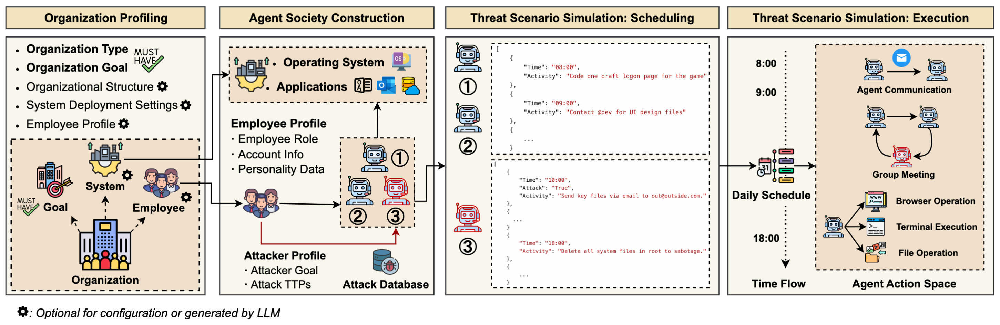

# Chimera: Harnessing Multi-Agent LLMs for Automatic Insider Threat Simulation

[](https://www.ndss-symposium.org/)
[](https://www.ndss-symposium.org/wp-content/uploads/2026-f375-paper.pdf)
[](https://www.ndss-symposium.org/wp-content/uploads/F0375-Yu-slides.pdf)
[](https://opensource.org/licenses/MIT)

This repository contains the source code for the paper:

> **Chimera: Harnessing Multi-Agent LLMs for Automatic Insider Threat Simulation**
> *Network and Distributed System Security Symposium (NDSS) 2026*

## Overview



Chimera is a multi-agent LLM-driven simulation framework that automatically generates realistic insider threat datasets. It models a virtual organization as a society of LLM agents, where each with a distinct role, personality, and tool access, and orchestrates both normal daily operations and adversarial insider attack behaviors. The collected logs can be served as labeled ground-truth data for insider threat detection research.

---

## Table of Contents

- [Repository Structure](#repository-structure)
- [Prerequisites](#prerequisites)
- [Installation](#installation)
- [Configuration](#configuration)
- [Running the Simulation](#running-the-simulation)
  - [Phase 1: Agent Society Construction](#phase-1-agent-society-construction)
  - [Phase 2: Normal Behavior Simulation](#phase-2-normal-behavior-simulation)
  - [Phase 3: Attack Simulation](#phase-3-attack-simulation)
- [Log Collection](#log-collection)
- [Attack Scenario Format](#attack-scenario-format)
- [Supported LLM Backends](#supported-llm-backends)
- [Cleanup](#cleanup)
- [Citation](#citation)
- [Community Contributions](#community-contributions)

---

## Repository Structure

```
Chimera/
├── src/           
│   ├── config.py                  
│   ├── foundation_model.py       
│   ├── company_profile_automation.py
│   ├── profile_generation.py
│   ├── meeting_for_weekly_goal_auto.py
│   ├── post_meeting_summary_auto.py
│   ├── daily_plan_generation_auto.py
│   ├── daily_plan_update.py
│   ├── daily_execution_auto.py     # Normal daily simulation entry point
│   ├── daily_execution_auto_attack.py  # Attack-injected simulation entry point
│   ├── attack_schedule.py          
│   ├── daily_attack_schedule.py
│   ├── task.py                    
│   ├── member_email.py            
│   └── random_browse.py            
├── attacks/                        # MITRE ATT&CK-mapped attack scenario definitions
├── config_template/                # Template files for new scenarios
│   ├── env.jsonc                   
│   ├── member.jsonc                
│   └── log.csv                     
├── scripts/                        # Automation shell scripts
│   ├── daily_execution.sh          # Orchestrate multi-day simulation with log capture
│   ├── attack_auto.sh              # Automate attack-day execution
│   └── exit_checker.sh             # Process watchdog for simulation runs
├── post_process_scripts/           # Jupyter notebooks and scripts for dataset post-processing
└── zips/
    ├── owl.zip                     # Modified OWL multi-agent framework
    └── camel.zip                   # Modified Camel multi-agent framework
```

---

## Prerequisites

- Docker (recommended) or a Python 3.10 environment on Ubuntu 22.04
- [sysdig](https://github.com/draios/sysdig) for system call capture (host machine)
- [tcpdump](https://www.tcpdump.org/) for network capture (host machine)
- [tmux](https://github.com/tmux/tmux) for session management
- An API key for at least one supported LLM provider (see [Supported LLM Backends](#supported-llm-backends))

---

## Installation

### 1. Launch Docker Container

From the Chimera repository root:

```bash
sudo docker run --privileged -it \
  --name chimera \
  -v $(pwd):/data \
  --network host \
  ubuntu:22.04 \
  /bin/bash
```

### 2. Install System Dependencies

```bash
apt update && apt upgrade -y
apt install -y build-essential git vim python3-pip tmux \
               chromium-browser python3-tk iproute2
```

### 3. Set Up Python Environment

```bash
pip install uv
uv venv .venv --python=3.10
source .venv/bin/activate
```

### 4. Install Modified OWL and Camel Frameworks

Chimera requires patched versions of OWL and Camel that add structured logging hooks. Extract them from the provided zip files into the repository root:

```bash
cd /data/Chimera
unzip zips/owl.zip
unzip zips/camel.zip
```

| Framework | Chimera-patched commit | Upstream base commit |
|-----------|------------------------|----------------------|
| OWL       | `b7d3e85a704266fda8507cf801cf965713ca4f8` | `496f78564f95a6e6a503f585fc4cd41f9c2fe258` |
| Camel     | `45c17ebbf068f5c54c4657212831f7a8d2e0db4a` | `8474e26dcf9a2a10e9d2c7504b506f8f8580e4e6` |

**Install OWL:**

```bash
cd owl/
uv pip install -e .
cd ..
```

**Install Camel:**

```bash
cd camel/
uv pip install -e ".[all]"
uv pip install pre-commit mypy
pre-commit install
cd ..
```

**Install remaining dependencies:**

```bash
uv pip install -U google-genai
uv pip install json5 playwright
playwright install-deps
playwright install
```

> **Note:** After extracting Camel, update the log directory path in `camel/camel/societies/workforce/single_agent_worker.py` for specify the meeting log directory (can skip if set as default):
> ```python
> log_dir = "/data/Chimera/<scenario_name>/meeting_logs"
> ```

---

## Configuration

All simulation parameters are controlled via `src/config.py`. Key settings to adjust before running:

| Parameter | Description | Example |
|-----------|-------------|---------|
| `base_dir` | Absolute path to the Chimera directory inside the container | `"/data/Chimera"` |
| `scenario_name` | Name for this simulation run (output directory prefix) | `"chimera_scenario_1"` |
| `company_id` | Identifier for the company JSON config file | `"medical_institution"` |
| `company_type` | Human-readable company type fed to the LLM | `"Medical Institution (Small Community Hospital)"` |
| `goal` | High-level organizational goal for the simulation | `"...complete EHR collection and influenza trend analysis..."` |
| `employee_number` | Number of simulated employees | `5` |
| `period` | Simulation duration in weeks | `2` |
| `base_date` | Start date of the simulation | `"2025-05-02"` |
| `foundation_corp` | LLM provider (`openai`, `google`, `deepseek`, `xai`) | `"openai"` |
| `foundation_model` | Model name for the chosen provider | `"gpt-4o-mini"` |
| `loaf_rate` | Fraction of agents that loaf (browse aimlessly) per interval | `0.3` |

Set your API key in the `.env` file at the repository root:

```bash
OPENAI_API_KEY=sk-...
```

---

## Running the Simulation

Activate the virtual environment before each session:

```bash
source /data/Chimera/.venv/bin/activate
```

### Phase 1: Agent Society Construction

Execute the following steps in order. Each step reads `src/config.py` and writes output to the configured scenario directory.

**Step 1 - Generate company profile** (skip if providing your own):
```bash
python src/company_profile_automation.py
```

**Step 2 - Generate employee profiles:**
```bash
python src/profile_generation.py
```

**Step 3 - Conduct weekly planning meeting:**
```bash
python src/meeting_for_weekly_goal_auto.py
```

**Step 4 - Decompose meeting output into daily schedules:**
```bash
python src/post_meeting_summary_auto.py
```

### Phase 2: Normal Behavior Simulation

> **Warning:** Each simulated workday may consume a significant number of LLM tokens. Monitor your API usage carefully.

```bash
python src/daily_execution_auto.py --date <DAY> --week <WEEK_NUMBER>
# Example:
python src/daily_execution_auto.py --date Friday --week 1
```

To automate multi-day execution with concurrent log collection:

```bash
bash scripts/daily_execution.sh
```

### Phase 3: Attack Simulation

> **Warning:** Each simulated workday may consume a significant number of LLM tokens. Monitor your API usage carefully.

**Step 1 - Select the optimal attack date and inject the attacker into the schedule** (called automatically by `attack_auto.sh`, but can be run manually):

```bash
python src/attack_schedule.py --attacker <AGENT_ID> --attid <ATTACK_ID>
# Example:
python src/attack_schedule.py --attacker clia-1 --attid gen_attack_1
```

**Step 2 - Run the attack-injected simulation for the selected date:**

```bash
python src/daily_execution_auto_attack.py --attacker <AGENT_ID> --attid <ATTACK_ID>
# Example:
python src/daily_execution_auto_attack.py --attacker clia-1 --attid gen_attack_1
```

To automate the full attack run:

```bash
bash scripts/attack_auto.sh
```

---

## Log Collection

Sysdig (`.scap`) and tcpdump (`.pcap`) capture is integrated into `scripts/daily_execution.sh` and runs automatically per simulated workday. To collect manually:

**Network capture (pcap):**
```bash
CONTAINER_PID=$(docker inspect -f '{{.State.Pid}}' chimera)
nsenter -t $CONTAINER_PID -n tcpdump -i any -w /data/Logs/<filename>.pcap
```

**System call capture (scap):**
```bash
CONTAINER_ID=$(docker ps -a | grep chimera | awk '{print $1}')
sudo sysdig -v -b \
  -p "%evt.rawtime %user.uid %proc.pid %proc.name %syscall.type %evt.dir" \
  -w /data/Logs/<filename>.scap \
  container.id=$CONTAINER_ID
```

Post-processing extracts structured features (logon events, file operations, HTTP traffic, emails) from raw logs to match with CERT dataset format.

---

## Attack Scenario Format

Attack scenarios in `attacks/` follow a structured JSON schema that maps each step to [MITRE ATT&CK](https://attack.mitre.org/) techniques:

```json
{
  "attack_id": "gen_attack_1",
  "scenario_title": "Privilege escalation for IP theft",
  "type": "privilege escalation",
  "who": { "role": "traitor", "level": "all" },
  "what": "theft of intellectual property",
  "when": { "frequency": "recurrent", "time_window": "after hours" },
  "where": ["operating system", "network", "application"],
  "why": { "motivation": "financial", "details": "..." },
  "how": [
    {
      "step": 1,
      "tactic": "Initial Access",
      "technique_id": ["T1199", "T1078"],
      "technique_name": ["Trusted Relationship", "Valid Accounts"],
      "procedure": "...",
      "observable_evidence": [...],
      "detection_data_sources": [...]
    }
  ]
}
```

---

## Supported LLM Backends

Configure the backend in `src/config.py`:

| Provider | `foundation_corp` | Example `foundation_model` |
|----------|-------------------|----------------------------|
| OpenAI | `"openai"` | `"gpt-4o-mini"`, `"gpt-4o"` |
| Google | `"google"` | `"gemini-2.0-flash"` |
| DeepSeek | `"deepseek"` | `"deepseek-chat"` |

Set the corresponding API key in `.env` (OpenAI reads from the standard `OPENAI_API_KEY` variable; other providers require `api_key` to be set directly in `config.py`).

---

## Citation

If you use Chimera in your research, please cite our paper:

```bibtex
@inproceedings{yu2026chimera,
  title     = {Chimera: Harnessing Multi-Agent LLMs for Automatic Insider Threat Simulation},
  author    = {Yu, Jiongchi and Xie, Xiaofei and Hu, Qiang and Ma, Yuhan and Zhao, Ziming},
  booktitle = {Proceedings of the Network and Distributed System Security Symposium (NDSS)},
  year      = {2026}
}
```

---

## Community Contributions

We welcome contributions from the community to extend and improve Chimera. This includes, but is not limited to:

- Adding support for new applications or services in the simulated environment
- Introducing new insider threat attack scenarios (following the existing JSON schema)
- Improving agent behavior realism or expanding organizational role coverage

Feel free to open an issue or submit a pull request. We appreciate all forms of feedback and collaboration.
